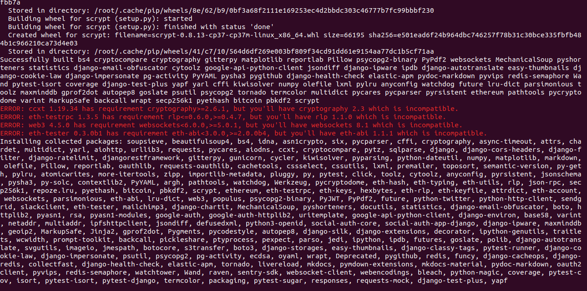
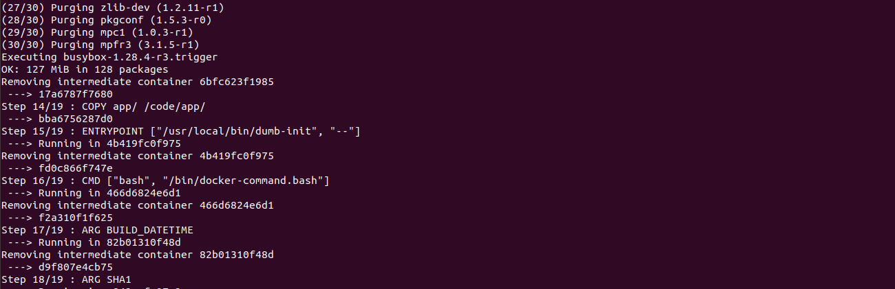
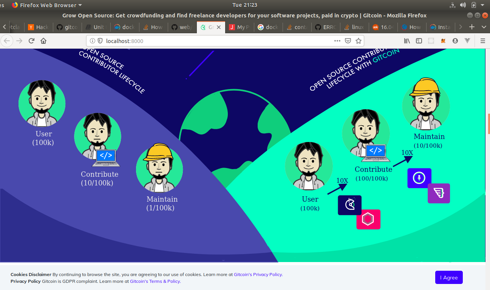
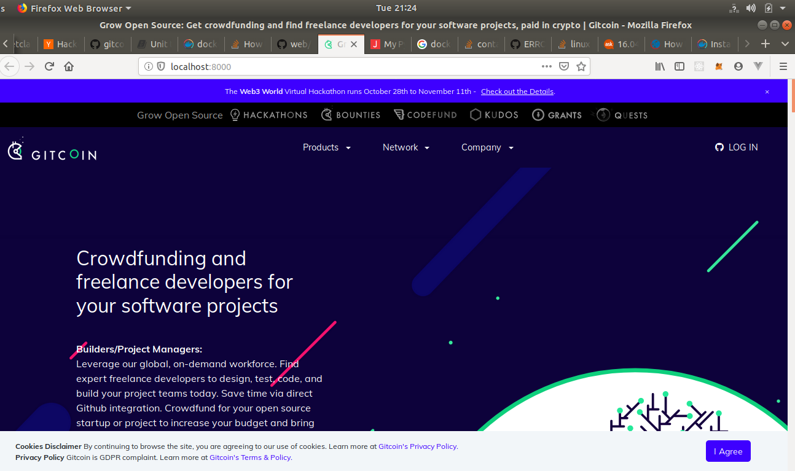
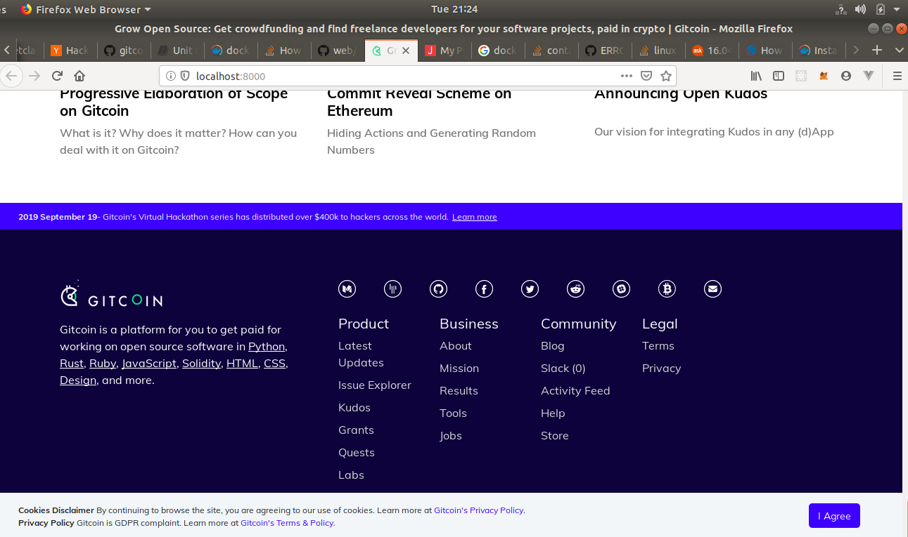
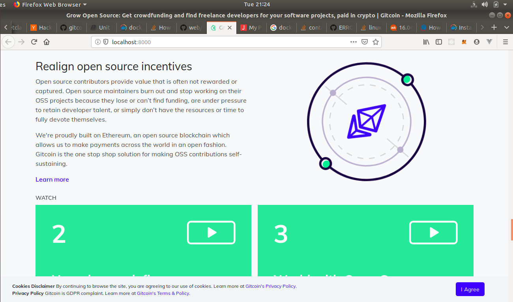

# How to run gitcoin web locally on your computer

*Check that you have Docker and Docker-compose are installed*
```shell
docker --version
Docker version 18.09.7, build 2d0083d

docker-compose --version
docker-compose version 1.24.1, build 4667896b
```
The above worked for me.

### Installation of Docker and Docker-compose
1. https://docs.docker.com/ - install!
[Docker](https://docs.docker.com/)
1.  https://docs.docker.com/compose/install/ - install!
[Docker-compose](https://docs.docker.com/compose/install/)


#### Clone Gitcoin web repo and rename environment file
```shell
git clone https://github.com/gitcoinco/web.git && cd web
cp app/app/local.env app/app/.env
```

## Starting Gitcoin server and user app

```shell
docker-compose up -d --build
```

The above would create a bacground daemon when it finished installation. It takes pretty long time, mine was about an hour plus. The good news is that it runs on its own. If you have error while running this it is likely to come from docker and docker-compose.






Point your browser to  `http://localhost:8000/`.
Note that with the above installation gitcoin server runs a service and it is also there. You can use `kill process` or docker-compose to stop it.










## Continue having fun
```shell
make
```
This would like commands that you can use to play with Gitcoin web. However, they are for developer. If you want to play around some may be some special docker setup. `make build` uses for docker experimental functions.
```shell
sudo nano /etc/docker/daemon.json
```
Copy and paste
```
{ 
    "experimental": true 
} 
```